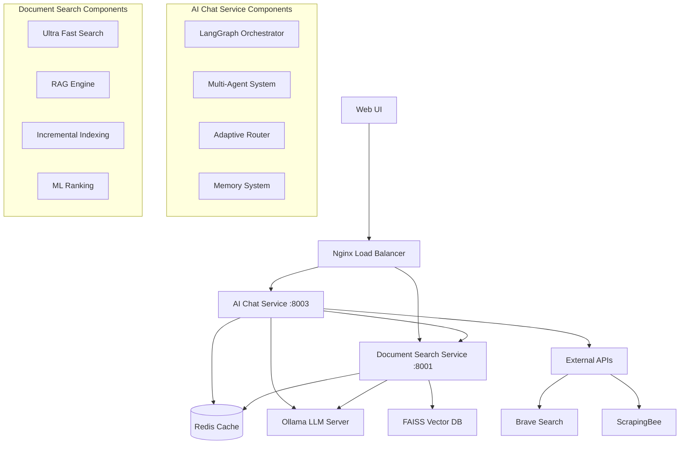

# 🛠️ Unified AI System - Developer Guide

## 📖 Table of Contents

1. [Architecture Overview](#architecture-overview)
2. [Development Environment](#development-environment)
3. [Code Structure](#code-structure)
4. [Contributing Guidelines](#contributing-guidelines)
5. [Testing Framework](#testing-framework)
6. [Performance Guidelines](#performance-guidelines)
7. [Integration Patterns](#integration-patterns)
8. [Debugging & Profiling](#debugging--profiling)
9. [Best Practices](#best-practices)
10. [Extension Development](#extension-development)

## 🏗️ Architecture Overview

### System Architecture



### Core Technologies

| Component | Technology | Purpose |
|-----------|------------|---------|
| **Web Framework** | FastAPI | High-performance async API |
| **Orchestration** | LangGraph | AI workflow management |
| **Vector Database** | FAISS + HNSW | Document similarity search |
| **Caching** | Redis | Distributed caching layer |
| **LLM Server** | Ollama | Local model serving |
| **ML Ranking** | LambdaMART | Search result ranking |
| **Compression** | IVF+PQ | Vector compression |
| **Monitoring** | Prometheus | Metrics collection |

### Service Communication

```python
# Inter-service communication pattern
class ServiceClient:
    def __init__(self, base_url: str, timeout: int = 30):
        self.base_url = base_url
        self.timeout = timeout
        self.session = aiohttp.ClientSession(
            timeout=aiohttp.ClientTimeout(total=timeout)
        )
    
    async def call_service(self, endpoint: str, data: dict) -> dict:
        url = f"{self.base_url}/{endpoint}"
        async with self.session.post(url, json=data) as response:
            return await response.json()
```

## 💻 Development Environment

### Prerequisites

```bash
# Install system dependencies
sudo apt update && sudo apt install -y \
    python3.10 python3.10-pip python3.10-venv \
    git curl wget build-essential \
    redis-server docker.io docker-compose

# Install Ollama
curl -fsSL https://ollama.ai/install.sh | sh
```

### IDE Setup

#### VS Code Configuration

Create `.vscode/settings.json`:

```json
{
    "python.defaultInterpreterPath": "./ai-chat-service/venv/bin/python",
    "python.linting.enabled": true,
    "python.linting.pylintEnabled": false,
    "python.linting.flake8Enabled": true,
    "python.linting.mypyEnabled": true,
    "python.formatting.provider": "black",
    "python.formatting.blackArgs": ["--line-length", "88"],
    "python.sortImports.args": ["--profile", "black"],
    "editor.formatOnSave": true,
    "editor.codeActionsOnSave": {
        "source.organizeImports": true
    },
    "files.exclude": {
        "**/__pycache__": true,
        "**/*.pyc": true,
        "**/venv": true,
        "**/.pytest_cache": true
    }
}
```

Create `.vscode/launch.json`:

```json
{
    "version": "0.2.0",
    "configurations": [
        {
            "name": "AI Chat Service",
            "type": "python",
            "request": "launch",
            "program": "${workspaceFolder}/ai-chat-service/app/main.py",
            "env": {
                "PYTHONPATH": "${workspaceFolder}/ai-chat-service",
                "DEBUG": "true",
                "LOG_LEVEL": "DEBUG"
            },
            "cwd": "${workspaceFolder}/ai-chat-service",
            "console": "integratedTerminal"
        },
        {
            "name": "Document Search Service",
            "type": "python",
            "request": "launch",
            "program": "${workspaceFolder}/document-search-service/app/main.py",
            "env": {
                "PYTHONPATH": "${workspaceFolder}/document-search-service",
                "DEBUG": "true"
            },
            "cwd": "${workspaceFolder}/document-search-service",
            "console": "integratedTerminal"
        }
    ]
}
```

#### PyCharm Configuration

1. **Project Structure**:
   - Mark `ai-chat-service` and `document-search-service` as source roots
   - Set Python interpreter to each service's virtual environment

2. **Code Style**:
   - Enable Black formatter
   - Set line length to 88
   - Enable import optimization

3. **Run Configurations**:
   - Create run configs for each service with proper environment variables

### Git Workflow

#### Pre-commit Hooks

Create `.pre-commit-config.yaml`:

```yaml
default_language_version:
  python: python3.10

repos:
  - repo: https://github.com/pre-commit/pre-commit-hooks
    rev: v4.4.0
    hooks:
      - id: trailing-whitespace
      - id: end-of-file-fixer
      - id: check-merge-conflict
      - id: check-yaml
      - id: check-json
      - id: check-toml

  - repo: https://github.com/psf/black
    rev: 23.7.0
    hooks:
      - id: black
        language_version: python3.10

  - repo: https://github.com/pycqa/isort
    rev: 5.12.0
    hooks:
      - id: isort
        args: ["--profile", "black"]

  - repo: https://github.com/pycqa/flake8
    rev: 6.0.0
    hooks:
      - id: flake8
        args: [--max-line-length=88, --extend-ignore=E203,W503]

  - repo: https://github.com/pre-commit/mirrors-mypy
    rev: v1.5.1
    hooks:
      - id: mypy
        additional_dependencies: [types-all]
```

Install pre-commit:

```bash
pip install pre-commit
pre-commit install
```

## 📁 Code Structure

### AI Chat Service Structure

```
ai-chat-service/
├── app/
│   ├── __init__.py
│   ├── main.py                     # FastAPI application entry point
│   ├── api/                        # API route handlers
│   │   ├── chat.py                 # Chat endpoints
│   │   ├── research.py             # Research endpoints
│   │   ├── search.py               # Search endpoints
│   │   └── monitoring_routes.py    # Monitoring endpoints
│   ├── graphs/                     # LangGraph workflows
│   │   ├── base.py                 # Base graph classes
│   │   ├── chat_graph.py           # Chat workflow
│   │   └── search_graph.py         # Search workflow
│   ├── agents/                     # Multi-agent system
│   │   └── multi_agent_orchestrator.py
│   ├── memory/                     # Memory management
│   │   ├── redis_memory.py         # Redis memory backend
│   │   └── contextual_bandit.py    # Contextual bandit algorithms
│   ├── providers/                  # External service providers
│   │   ├── brave_search_provider.py
│   │   └── scrapingbee_provider.py
│   ├── core/                       # Core utilities
│   │   ├── config.py               # Configuration management
│   │   ├── logging.py              # Logging setup
│   │   └── async_utils.py          # Async utilities
│   ├── schemas/                    # Pydantic models
│   │   ├── requests.py             # Request schemas
│   │   └── responses.py            # Response schemas
│   └── optimization/               # Performance optimization
│       ├── intelligent_streaming.py
│       └── enhanced_cache.py
├── tests/                          # Test suite
│   ├── unit/                       # Unit tests
│   ├── integration/                # Integration tests
│   └── conftest.py                 # Pytest configuration
├── requirements.txt                # Python dependencies
├── Dockerfile                      # Docker configuration
└── pytest.ini                     # Pytest settings
```

### Document Search Service Structure

```
document-search-service/
├── app/
│   ├── __init__.py
│   ├── main.py                     # FastAPI application
│   ├── api/                        # API endpoints
│   │   └── ultra_fast_search.py    # Search API
│   ├── search/                     # Search engine
│   │   └── ultra_fast_engine.py    # Core search engine
│   ├── math/                       # Mathematical algorithms
│   │   ├── hnsw_index.py           # HNSW implementation
│   │   ├── ivf_pq_index.py         # IVF+PQ compression
│   │   ├── lambdamart_scorer.py    # ML ranking
│   │   └── lsh_index.py            # LSH hashing
│   ├── rag/                        # RAG implementation
│   │   ├── enhanced_engine.py      # RAG engine
│   │   ├── integration.py          # RAG integration
│   │   └── api.py                  # RAG API endpoints
│   ├── processing/                 # Document processing
│   │   └── batch_processor.py      # Batch processing
│   ├── indexing/                   # Document indexing
│   │   └── incremental.py          # Incremental indexing
│   └── monitoring/                 # Monitoring utilities
│       ├── health.py               # Health checks
│       └── metrics.py              # Metrics collection
├── data/                           # Document storage
│   ├── documents/                  # Raw documents
│   └── rag_documents/              # Processed documents
├── indexes/                        # Search indexes
└── requirements.txt                # Dependencies
```

### Key Components Deep Dive

#### LangGraph Workflow Example

```python
# ai-chat-service/app/graphs/chat_graph.py
from langgraph import StateGraph, END
from typing import TypedDict, List, Optional

class ChatState(TypedDict):
    """State passed between graph nodes."""
    messages: List[dict]
    context: Optional[dict]
    routing_decision: Optional[str]
    final_response: Optional[str]
    metadata: dict

class ChatGraph:
    def __init__(self, model_manager, cache_manager):
        self.model_manager = model_manager
        self.cache_manager = cache_manager
        self.graph = self._build_graph()
    
    def _build_graph(self) -> StateGraph:
        """Build the chat processing graph."""
        workflow = StateGraph(ChatState)
        
        # Add nodes
        workflow.add_node("context_manager", self.manage_context)
        workflow.add_node("intent_classifier", self.classify_intent)
        workflow.add_node("response_generator", self.generate_response)
        workflow.add_node("quality_checker", self.check_quality)
        
        # Define edges
        workflow.set_entry_point("context_manager")
        workflow.add_edge("context_manager", "intent_classifier")
        workflow.add_edge("intent_classifier", "response_generator")
        workflow.add_edge("response_generator", "quality_checker")
        workflow.add_edge("quality_checker", END)
        
        return workflow.compile()
    
    async def manage_context(self, state: ChatState) -> ChatState:
        """Manage conversation context."""
        # Implementation for context management
        return state
    
    async def classify_intent(self, state: ChatState) -> ChatState:
        """Classify user intent."""
        # Intent classification logic
        return state
    
    async def generate_response(self, state: ChatState) -> ChatState:
        """Generate AI response."""
        # Response generation logic
        return state
    
    async def check_quality(self, state: ChatState) -> ChatState:
        """Check response quality."""
        # Quality checking logic
        return state
```

#### Ultra Fast Search Engine

```python
# document-search-service/app/search/ultra_fast_engine.py
import numpy as np
from typing import List, Dict, Any, Optional
import faiss
from app.math.hnsw_index import HNSWIndex
from app.math.lambdamart_scorer import LambdaMARTScorer

class UltraFastSearchEngine:
    def __init__(self, embedding_dim: int = 384):
        self.embedding_dim = embedding_dim
        self.hnsw_index = HNSWIndex(embedding_dim)
        self.ml_scorer = LambdaMARTScorer()
        self.documents = {}
        
    async def add_document(self, doc_id: str, embedding: np.ndarray, 
                          metadata: Dict[str, Any]) -> None:
        """Add document to search index."""
        # Add to HNSW index
        internal_id = await self.hnsw_index.add_vector(embedding)
        
        # Store document metadata
        self.documents[internal_id] = {
            'doc_id': doc_id,
            'embedding': embedding,
            'metadata': metadata
        }
    
    async def search(self, query_embedding: np.ndarray, 
                    top_k: int = 10) -> List[Dict[str, Any]]:
        """Perform ultra-fast search."""
        # 1. Initial retrieval with HNSW
        candidate_ids, similarities = await self.hnsw_index.search(
            query_embedding, top_k * 2  # Over-retrieve for re-ranking
        )
        
        # 2. Feature extraction for ML ranking
        features = []
        candidates = []
        
        for internal_id, similarity in zip(candidate_ids, similarities):
            if internal_id in self.documents:
                doc = self.documents[internal_id]
                
                # Extract features for ML ranking
                feature_vector = self._extract_features(
                    query_embedding, doc['embedding'], doc['metadata']
                )
                features.append(feature_vector)
                candidates.append((internal_id, similarity, doc))
        
        # 3. ML re-ranking with LambdaMART
        if features:
            ml_scores = await self.ml_scorer.score(np.array(features))
            
            # Combine similarity and ML scores
            final_scores = []
            for i, (internal_id, similarity, doc) in enumerate(candidates):
                combined_score = 0.6 * similarity + 0.4 * ml_scores[i]
                final_scores.append((combined_score, doc))
            
            # Sort by combined score
            final_scores.sort(key=lambda x: x[0], reverse=True)
            
            # Return top-k results
            results = []
            for score, doc in final_scores[:top_k]:
                results.append({
                    'doc_id': doc['doc_id'],
                    'score': float(score),
                    'similarity': float(similarities[candidates.index((
                        list(self.documents.keys())[list(self.documents.values()).index(doc)], 
                        similarities[0], doc
                    ))]),
                    'metadata': doc['metadata']
                })
            
            return results
        
        return []
    
    def _extract_features(self, query_emb: np.ndarray, 
                         doc_emb: np.ndarray, 
                         metadata: Dict[str, Any]) -> np.ndarray:
        """Extract features for ML ranking."""
        # Vector similarity features
        cosine_sim = np.dot(query_emb, doc_emb) / (
            np.linalg.norm(query_emb) * np.linalg.norm(doc_emb)
        )
        euclidean_dist = np.linalg.norm(query_emb - doc_emb)
        
        # Document features
        doc_length = metadata.get('content_length', 0)
        
        # BM25 features (simplified)
        bm25_score = metadata.get('bm25_score', 0.0)
        
        # Skill overlap features
        skill_overlap = metadata.get('skill_overlap', 0.0)
        
        # Additional features
        recency_score = metadata.get('recency_score', 0.0)
        authority_score = metadata.get('authority_score', 0.0)
        
        return np.array([
            cosine_sim,
            euclidean_dist,
            doc_length,
            bm25_score,
            skill_overlap,
            recency_score,
            authority_score,
            doc_length * cosine_sim  # Interaction feature
        ])
```

## 🤝 Contributing Guidelines

### Code Contribution Workflow

1. **Fork and Clone**:
```bash
git clone https://github.com/your-username/unified-ai-system-clean.git
cd unified-ai-system-clean
```

2. **Create Feature Branch**:
```bash
git checkout -b feature/your-feature-name
```

3. **Development Setup**:
```bash
# AI Chat Service
cd ai-chat-service
python3 -m venv venv
source venv/bin/activate
pip install -r requirements.txt
pip install -r requirements-dev.txt

# Document Search Service
cd ../document-search-service
python3 -m venv venv
source venv/bin/activate
pip install -r requirements.txt
pip install -r requirements-dev.txt
```

4. **Make Changes**:
   - Follow coding standards (Black, isort, flake8)
   - Add tests for new features
   - Update documentation

5. **Run Tests**:
```bash
# Run all tests
pytest

# Run specific test file
pytest tests/test_specific_feature.py

# Run with coverage
pytest --cov=app tests/
```

6. **Pre-commit Checks**:
```bash
pre-commit run --all-files
```

7. **Commit and Push**:
```bash
git add .
git commit -m "feat: add new feature description"
git push origin feature/your-feature-name
```

8. **Create Pull Request**:
   - Use descriptive title and description
   - Reference related issues
   - Include screenshots if UI changes
   - Ensure CI passes

### Coding Standards

#### Python Style Guide

```python
# Good: Clear function with type hints and docstring
async def process_chat_request(
    message: str,
    session_id: Optional[str] = None,
    quality: QualityLevel = QualityLevel.BALANCED,
    max_cost: float = 0.10
) -> ChatResponse:
    """
    Process a chat request with intelligent routing.
    
    Args:
        message: User's chat message
        session_id: Optional session identifier
        quality: Quality level for processing
        max_cost: Maximum cost limit in INR
        
    Returns:
        ChatResponse with generated content and metadata
        
    Raises:
        ValidationError: If input parameters are invalid
        CostExceededException: If processing would exceed max_cost
    """
    # Validate inputs
    if not message.strip():
        raise ValidationError("Message cannot be empty")
    
    # Process request
    try:
        result = await chat_processor.process(
            message=message,
            session_id=session_id,
            quality=quality,
            cost_limit=max_cost
        )
        return result
    except Exception as e:
        logger.error(f"Chat processing failed: {e}", exc_info=True)
        raise
```

#### Error Handling Patterns

```python
# Good: Comprehensive error handling
class ServiceError(Exception):
    """Base exception for service errors."""
    pass

class ValidationError(ServiceError):
    """Raised when input validation fails."""
    pass

class RateLimitError(ServiceError):
    """Raised when rate limit is exceeded."""
    pass

async def safe_api_call(func, *args, **kwargs):
    """Safely call API with proper error handling."""
    try:
        return await func(*args, **kwargs)
    except aiohttp.ClientTimeout:
        raise ServiceError("Request timeout")
    except aiohttp.ClientError as e:
        raise ServiceError(f"Network error: {e}")
    except Exception as e:
        logger.error(f"Unexpected error in {func.__name__}: {e}")
        raise ServiceError("Internal service error")
```

#### Async Programming Best Practices

```python
# Good: Proper async/await usage
async def batch_process_documents(documents: List[Document]) -> List[ProcessedDocument]:
    """Process multiple documents concurrently."""
    tasks = []
    semaphore = asyncio.Semaphore(10)  # Limit concurrency
    
    async def process_with_limit(doc):
        async with semaphore:
            return await process_document(doc)
    
    # Create tasks
    for doc in documents:
        tasks.append(process_with_limit(doc))
    
    # Process concurrently
    results = await asyncio.gather(*tasks, return_exceptions=True)
    
    # Handle results and exceptions
    processed = []
    for i, result in enumerate(results):
        if isinstance(result, Exception):
            logger.error(f"Failed to process document {i}: {result}")
        else:
            processed.append(result)
    
    return processed
```

### Documentation Standards

#### API Documentation

```python
from pydantic import BaseModel, Field

class ChatRequest(BaseModel):
    """
    Chat request model for AI conversation endpoints.
    
    This model defines the structure for chat requests including
    message content, session management, and quality preferences.
    """
    
    message: str = Field(
        ...,
        description="The user's message to process",
        example="Explain quantum computing in simple terms",
        min_length=1,
        max_length=8000
    )
    
    session_id: Optional[str] = Field(
        None,
        description="Unique session identifier for conversation continuity",
        example="session_12345"
    )
    
    quality_requirement: QualityLevel = Field(
        QualityLevel.BALANCED,
        description="Quality level for response generation",
        example="balanced"
    )
    
    class Config:
        schema_extra = {
            "example": {
                "message": "What are the latest developments in AI?",
                "session_id": "user_session_001",
                "quality_requirement": "high"
            }
        }
```

#### Inline Documentation

```python
def calculate_similarity_score(
    query_embedding: np.ndarray,
    document_embedding: np.ndarray,
    method: str = "cosine"
) -> float:
    """
    Calculate similarity between query and document embeddings.
    
    This function supports multiple similarity metrics and is optimized
    for high-performance vector operations in search scenarios.
    
    Args:
        query_embedding: Query vector of shape (embedding_dim,)
        document_embedding: Document vector of shape (embedding_dim,)
        method: Similarity method ("cosine", "euclidean", "dot_product")
    
    Returns:
        Similarity score between 0.0 and 1.0
        
    Example:
        >>> query = np.array([0.1, 0.2, 0.3])
        >>> doc = np.array([0.15, 0.25, 0.35])
        >>> score = calculate_similarity_score(query, doc, "cosine")
        >>> print(f"Similarity: {score:.3f}")
        Similarity: 0.998
    """
    if method == "cosine":
        # Cosine similarity: efficient for normalized vectors
        return np.dot(query_embedding, document_embedding) / (
            np.linalg.norm(query_embedding) * np.linalg.norm(document_embedding)
        )
    elif method == "euclidean":
        # Convert Euclidean distance to similarity (0-1 range)
        distance = np.linalg.norm(query_embedding - document_embedding)
        return 1.0 / (1.0 + distance)
    elif method == "dot_product":
        # Simple dot product similarity
        return float(np.dot(query_embedding, document_embedding))
    else:
        raise ValueError(f"Unsupported similarity method: {method}")
```

## 🧪 Testing Framework

### Test Structure

```
tests/
├── unit/                           # Unit tests
│   ├── test_api/
│   │   ├── test_chat_endpoints.py
│   │   └── test_search_endpoints.py
│   ├── test_graphs/
│   │   └── test_chat_graph.py
│   └── test_core/
│       └── test_config.py
├── integration/                    # Integration tests
│   ├── test_service_integration.py
│   └── test_api_integration.py
├── performance/                    # Performance tests
│   ├── test_search_performance.py
│   └── test_concurrent_requests.py
└── fixtures/                       # Test fixtures
    ├── sample_documents.json
    └── test_responses.json
```

### Unit Testing Examples

```python
# tests/unit/test_api/test_chat_endpoints.py
import pytest
from fastapi.testclient import TestClient
from unittest.mock import AsyncMock, patch
from app.main import app
from app.schemas.requests import ChatRequest
from app.schemas.responses import ChatResponse

@pytest.fixture
def client():
    """Test client fixture."""
    return TestClient(app)

@pytest.fixture
def mock_chat_graph():
    """Mock chat graph for testing."""
    mock = AsyncMock()
    mock.execute.return_value = AsyncMock(
        final_response="Test response",
        execution_time=1.5,
        cost=0.05,
        confidence=0.9
    )
    return mock

@pytest.mark.asyncio
async def test_chat_complete_success(client, mock_chat_graph):
    """Test successful chat completion."""
    request_data = {
        "message": "Hello, world!",
        "session_id": "test_session",
        "quality_requirement": "balanced"
    }
    
    with patch('app.api.chat.app.state.chat_graph', mock_chat_graph):
        response = client.post("/api/v1/chat/complete", json=request_data)
    
    assert response.status_code == 200
    data = response.json()
    assert data["status"] == "success"
    assert "response" in data["data"]
    assert data["metadata"]["cost"] == 0.05

@pytest.mark.asyncio
async def test_chat_complete_validation_error(client):
    """Test chat completion with invalid input."""
    request_data = {
        "message": "",  # Empty message should fail validation
        "quality_requirement": "invalid"
    }
    
    response = client.post("/api/v1/chat/complete", json=request_data)
    
    assert response.status_code == 422
    data = response.json()
    assert "detail" in data

@pytest.mark.asyncio
async def test_chat_complete_timeout(client, mock_chat_graph):
    """Test chat completion timeout handling."""
    mock_chat_graph.execute.side_effect = asyncio.TimeoutError()
    
    request_data = {
        "message": "This should timeout",
        "session_id": "timeout_test"
    }
    
    with patch('app.api.chat.app.state.chat_graph', mock_chat_graph):
        response = client.post("/api/v1/chat/complete", json=request_data)
    
    assert response.status_code == 200
    data = response.json()
    assert "timeout" in data["data"]["response"].lower()
```

### Integration Testing

```python
# tests/integration/test_service_integration.py
import pytest
import aiohttp
import asyncio
from typing import Dict, Any

class TestServiceIntegration:
    """Integration tests for service communication."""
    
    @pytest.fixture
    def ai_chat_url(self):
        return "http://localhost:8003"
    
    @pytest.fixture
    def document_search_url(self):
        return "http://localhost:8001"
    
    @pytest.mark.asyncio
    async def test_health_checks(self, ai_chat_url, document_search_url):
        """Test that all services are healthy."""
        async with aiohttp.ClientSession() as session:
            # Check AI Chat Service
            async with session.get(f"{ai_chat_url}/health") as response:
                assert response.status == 200
                data = await response.json()
                assert data["status"] in ["healthy", "degraded"]
            
            # Check Document Search Service
            async with session.get(f"{document_search_url}/health") as response:
                assert response.status == 200
                data = await response.json()
                assert data["status"] == "healthy"
    
    @pytest.mark.asyncio
    async def test_end_to_end_chat_flow(self, ai_chat_url):
        """Test complete chat flow including document search."""
        async with aiohttp.ClientSession() as session:
            request_data = {
                "message": "Find information about machine learning algorithms",
                "session_id": "integration_test",
                "include_sources": True
            }
            
            async with session.post(
                f"{ai_chat_url}/api/v1/chat/complete",
                json=request_data
            ) as response:
                assert response.status == 200
                data = await response.json()
                
                assert data["status"] == "success"
                assert "response" in data["data"]
                assert "metadata" in data
                
                # Verify execution metadata
                metadata = data["metadata"]
                assert metadata["execution_time"] > 0
                assert metadata["cost"] >= 0
                assert len(metadata["models_used"]) > 0
    
    @pytest.mark.asyncio
    async def test_concurrent_requests(self, ai_chat_url):
        """Test handling of concurrent requests."""
        async def make_request(session, i):
            request_data = {
                "message": f"Test concurrent request {i}",
                "session_id": f"concurrent_test_{i}"
            }
            
            async with session.post(
                f"{ai_chat_url}/api/v1/chat/complete",
                json=request_data
            ) as response:
                return await response.json()
        
        async with aiohttp.ClientSession() as session:
            # Make 10 concurrent requests
            tasks = [make_request(session, i) for i in range(10)]
            results = await asyncio.gather(*tasks)
            
            # Verify all requests succeeded
            for result in results:
                assert result["status"] == "success"
                assert "response" in result["data"]
```

### Performance Testing

```python
# tests/performance/test_search_performance.py
import time
import asyncio
import statistics
from typing import List
import numpy as np

class TestSearchPerformance:
    """Performance tests for search functionality."""
    
    @pytest.mark.performance
    async def test_search_latency_benchmark(self, document_search_url):
        """Benchmark search latency under various conditions."""
        
        test_queries = [
            "machine learning algorithms",
            "data science techniques", 
            "artificial intelligence applications",
            "neural network architectures",
            "deep learning frameworks"
        ]
        
        latencies = []
        
        async with aiohttp.ClientSession() as session:
            for query in test_queries:
                for _ in range(20):  # 20 runs per query
                    start_time = time.time()
                    
                    async with session.post(
                        f"{document_search_url}/api/v2/search/ultra-fast",
                        json={"query": query, "max_results": 10}
                    ) as response:
                        await response.json()
                    
                    latency = (time.time() - start_time) * 1000  # Convert to ms
                    latencies.append(latency)
        
        # Calculate statistics
        mean_latency = statistics.mean(latencies)
        p95_latency = np.percentile(latencies, 95)
        p99_latency = np.percentile(latencies, 99)
        
        print(f"Search Performance Results:")
        print(f"Mean latency: {mean_latency:.2f}ms")
        print(f"P95 latency: {p95_latency:.2f}ms")
        print(f"P99 latency: {p99_latency:.2f}ms")
        
        # Performance assertions
        assert mean_latency < 200.0, f"Mean latency too high: {mean_latency}ms"
        assert p95_latency < 300.0, f"P95 latency too high: {p95_latency}ms"
        assert p99_latency < 500.0, f"P99 latency too high: {p99_latency}ms"
    
    @pytest.mark.performance
    async def test_throughput_benchmark(self, ai_chat_url):
        """Benchmark request throughput."""
        
        async def make_request(session, semaphore, request_id):
            async with semaphore:
                request_data = {
                    "message": f"Throughput test request {request_id}",
                    "session_id": f"throughput_{request_id}"
                }
                
                start_time = time.time()
                async with session.post(
                    f"{ai_chat_url}/api/v1/chat/complete",
                    json=request_data
                ) as response:
                    await response.json()
                
                return time.time() - start_time
        
        # Test with different concurrency levels
        concurrency_levels = [1, 5, 10, 20]
        
        for concurrency in concurrency_levels:
            semaphore = asyncio.Semaphore(concurrency)
            
            async with aiohttp.ClientSession() as session:
                start_time = time.time()
                
                tasks = [
                    make_request(session, semaphore, i) 
                    for i in range(100)  # 100 requests
                ]
                
                await asyncio.gather(*tasks)
                
                total_time = time.time() - start_time
                throughput = 100 / total_time  # requests per second
                
                print(f"Concurrency {concurrency}: {throughput:.2f} RPS")
                
                # Minimum throughput assertions
                if concurrency == 1:
                    assert throughput >= 5.0, f"Sequential throughput too low: {throughput} RPS"
                elif concurrency == 10:
                    assert throughput >= 15.0, f"Concurrent throughput too low: {throughput} RPS"
```

### Test Configuration

Create `pytest.ini`:

```ini
[tool:pytest]
minversion = 6.0
addopts = 
    -ra
    -q
    --strict-markers
    --strict-config
    --cov=app
    --cov-report=term-missing
    --cov-report=html
    --cov-report=xml
testpaths = tests
markers =
    unit: Unit tests
    integration: Integration tests
    performance: Performance tests
    slow: Slow running tests
filterwarnings =
    ignore::DeprecationWarning
    ignore::PendingDeprecationWarning
```

## ⚡ Performance Guidelines

### Memory Optimization

```python
# Good: Memory-efficient document processing
import gc
from typing import Iterator, Dict, Any

class MemoryEfficientDocumentProcessor:
    """Process documents with minimal memory footprint."""
    
    def __init__(self, batch_size: int = 1000):
        self.batch_size = batch_size
    
    def process_documents(self, documents: Iterator[Dict[str, Any]]) -> Iterator[Dict[str, Any]]:
        """Process documents in batches to control memory usage."""
        batch = []
        
        for doc in documents:
            batch.append(doc)
            
            if len(batch) >= self.batch_size:
                # Process batch
                processed_batch = self._process_batch(batch)
                
                # Yield results
                for processed_doc in processed_batch:
                    yield processed_doc
                
                # Clear batch and force garbage collection
                batch.clear()
                gc.collect()
        
        # Process remaining documents
        if batch:
            processed_batch = self._process_batch(batch)
            for processed_doc in processed_batch:
                yield processed_doc
    
    def _process_batch(self, documents: List[Dict[str, Any]]) -> List[Dict[str, Any]]:
        """Process a batch of documents."""
        # Efficient batch processing implementation
        return documents  # Simplified
```

### Async Optimization

```python
# Good: Efficient async patterns
import asyncio
from asyncio import Semaphore
from typing import List, Awaitable, TypeVar

T = TypeVar('T')

async def bounded_gather(
    coroutines: List[Awaitable[T]], 
    limit: int = 10
) -> List[T]:
    """Execute coroutines with bounded concurrency."""
    semaphore = Semaphore(limit)
    
    async def bounded_coro(coro: Awaitable[T]) -> T:
        async with semaphore:
            return await coro
    
    return await asyncio.gather(
        *[bounded_coro(coro) for coro in coroutines]
    )

# Usage
search_tasks = [search_document(doc) for doc in documents]
results = await bounded_gather(search_tasks, limit=20)
```

### Caching Strategies

```python
# Good: Multi-level caching
import asyncio
from functools import wraps
from typing import Optional, Callable, Any
import hashlib
import json

class MultiLevelCache:
    """Multi-level caching with memory and Redis."""
    
    def __init__(self, redis_client, memory_size: int = 1000):
        self.redis = redis_client
        self.memory_cache = {}
        self.memory_size = memory_size
        self.access_order = []
    
    def cache_key(self, func_name: str, args: tuple, kwargs: dict) -> str:
        """Generate cache key from function call."""
        key_data = {
            'func': func_name,
            'args': args,
            'kwargs': kwargs
        }
        key_str = json.dumps(key_data, sort_keys=True)
        return hashlib.md5(key_str.encode()).hexdigest()
    
    async def get(self, key: str) -> Optional[Any]:
        """Get value from cache (memory first, then Redis)."""
        # Check memory cache first
        if key in self.memory_cache:
            # Update access order for LRU
            self.access_order.remove(key)
            self.access_order.append(key)
            return self.memory_cache[key]
        
        # Check Redis cache
        try:
            value = await self.redis.get(key)
            if value:
                # Store in memory cache
                await self._store_in_memory(key, value)
                return value
        except Exception:
            pass  # Redis unavailable
        
        return None
    
    async def set(self, key: str, value: Any, ttl: int = 3600):
        """Set value in both caches."""
        # Store in memory
        await self._store_in_memory(key, value)
        
        # Store in Redis
        try:
            await self.redis.setex(key, ttl, value)
        except Exception:
            pass  # Redis unavailable
    
    async def _store_in_memory(self, key: str, value: Any):
        """Store value in memory cache with LRU eviction."""
        if len(self.memory_cache) >= self.memory_size:
            # Evict least recently used
            lru_key = self.access_order.pop(0)
            del self.memory_cache[lru_key]
        
        self.memory_cache[key] = value
        if key in self.access_order:
            self.access_order.remove(key)
        self.access_order.append(key)

def cached(ttl: int = 3600):
    """Decorator for caching function results."""
    def decorator(func: Callable):
        @wraps(func)
        async def wrapper(*args, **kwargs):
            cache = getattr(wrapper, '_cache', None)
            if not cache:
                return await func(*args, **kwargs)
            
            key = cache.cache_key(func.__name__, args, kwargs)
            result = await cache.get(key)
            
            if result is None:
                result = await func(*args, **kwargs)
                await cache.set(key, result, ttl)
            
            return result
        
        return wrapper
    return decorator
```

## 🔧 Debugging & Profiling

### Debugging Setup

```python
# app/core/debugging.py
import logging
import time
import functools
from typing import Callable, Any
import traceback

def debug_trace(func: Callable) -> Callable:
    """Decorator to trace function execution."""
    @functools.wraps(func)
    async def async_wrapper(*args, **kwargs):
        start_time = time.time()
        logger = logging.getLogger(func.__module__)
        
        logger.debug(f"Entering {func.__name__} with args={args}, kwargs={kwargs}")
        
        try:
            result = await func(*args, **kwargs)
            execution_time = time.time() - start_time
            logger.debug(f"Exiting {func.__name__} after {execution_time:.3f}s")
            return result
        except Exception as e:
            execution_time = time.time() - start_time
            logger.error(
                f"Exception in {func.__name__} after {execution_time:.3f}s: {e}\n"
                f"Traceback: {traceback.format_exc()}"
            )
            raise
    
    @functools.wraps(func)
    def sync_wrapper(*args, **kwargs):
        start_time = time.time()
        logger = logging.getLogger(func.__module__)
        
        logger.debug(f"Entering {func.__name__} with args={args}, kwargs={kwargs}")
        
        try:
            result = func(*args, **kwargs)
            execution_time = time.time() - start_time
            logger.debug(f"Exiting {func.__name__} after {execution_time:.3f}s")
            return result
        except Exception as e:
            execution_time = time.time() - start_time
            logger.error(
                f"Exception in {func.__name__} after {execution_time:.3f}s: {e}\n"
                f"Traceback: {traceback.format_exc()}"
            )
            raise
    
    return async_wrapper if asyncio.iscoroutinefunction(func) else sync_wrapper

# Usage
@debug_trace
async def complex_search_operation(query: str) -> List[Dict[str, Any]]:
    # Complex search logic
    pass
```

### Performance Profiling

```python
# scripts/profile_search.py
import cProfile
import pstats
import asyncio
import sys
from io import StringIO

async def profile_search_performance():
    """Profile search performance with cProfile."""
    from app.search.ultra_fast_engine import UltraFastSearchEngine
    import numpy as np
    
    # Setup
    engine = UltraFastSearchEngine()
    
    # Add sample documents
    for i in range(1000):
        embedding = np.random.rand(384).astype(np.float32)
        await engine.add_document(
            f"doc_{i}",
            embedding,
            {"content_length": 1000, "bm25_score": 0.5}
        )
    
    # Profile search operations
    def run_searches():
        loop = asyncio.new_event_loop()
        asyncio.set_event_loop(loop)
        
        async def search_batch():
            tasks = []
            for i in range(100):
                query_embedding = np.random.rand(384).astype(np.float32)
                tasks.append(engine.search(query_embedding, top_k=10))
            
            await asyncio.gather(*tasks)
        
        loop.run_until_complete(search_batch())
        loop.close()
    
    # Run profiler
    profiler = cProfile.Profile()
    profiler.enable()
    
    run_searches()
    
    profiler.disable()
    
    # Generate report
    stream = StringIO()
    stats = pstats.Stats(profiler, stream=stream).sort_stats('cumulative')
    stats.print_stats(20)  # Top 20 functions
    
    print("Search Performance Profile:")
    print(stream.getvalue())

if __name__ == "__main__":
    asyncio.run(profile_search_performance())
```

### Memory Profiling

```python
# scripts/memory_profile.py
import tracemalloc
import asyncio
import sys
from typing import Dict, Any

class MemoryProfiler:
    """Memory profiling utility."""
    
    def __init__(self):
        self.snapshots = {}
    
    def start_trace(self, name: str):
        """Start memory tracing."""
        if not tracemalloc.is_tracing():
            tracemalloc.start()
        
        self.snapshots[f"{name}_start"] = tracemalloc.take_snapshot()
    
    def end_trace(self, name: str) -> Dict[str, Any]:
        """End memory tracing and return stats."""
        end_snapshot = tracemalloc.take_snapshot()
        start_snapshot = self.snapshots.get(f"{name}_start")
        
        if not start_snapshot:
            return {"error": "No start snapshot found"}
        
        # Calculate differences
        top_stats = end_snapshot.compare_to(start_snapshot, 'lineno')
        
        total_diff = sum(stat.size_diff for stat in top_stats)
        
        stats = {
            "total_memory_diff": total_diff,
            "total_memory_diff_mb": total_diff / 1024 / 1024,
            "top_allocations": []
        }
        
        for stat in top_stats[:10]:  # Top 10
            stats["top_allocations"].append({
                "file": stat.traceback.format()[-1],
                "size_diff": stat.size_diff,
                "size_diff_kb": stat.size_diff / 1024,
                "count_diff": stat.count_diff
            })
        
        return stats

# Usage example
async def profile_document_processing():
    profiler = MemoryProfiler()
    
    profiler.start_trace("document_processing")
    
    # Simulate document processing
    documents = []
    for i in range(10000):
        documents.append({
            "id": f"doc_{i}",
            "content": f"This is document {i} " * 100,
            "metadata": {"size": i * 100}
        })
    
    # Process documents
    processed = []
    for doc in documents:
        processed.append({
            "processed_content": doc["content"].upper(),
            "word_count": len(doc["content"].split())
        })
    
    stats = profiler.end_trace("document_processing")
    
    print("Memory Profile Results:")
    print(f"Total memory change: {stats['total_memory_diff_mb']:.2f} MB")
    print("Top memory allocations:")
    for alloc in stats["top_allocations"]:
        print(f"  {alloc['size_diff_kb']:.1f} KB: {alloc['file']}")

if __name__ == "__main__":
    asyncio.run(profile_document_processing())
```

## 🎯 Best Practices

### API Design Best Practices

1. **Consistent Response Format**:
```python
# Always use consistent response structure
{
    "status": "success|error|partial",
    "data": {...},
    "metadata": {
        "query_id": "unique_id",
        "execution_time": 1.23,
        "cost": 0.05
    },
    "error_details": {...}  # Only present on error
}
```

2. **Proper Error Messages**:
```python
# Good: Informative error responses
{
    "status": "error",
    "message": "Document not found",
    "error_details": {
        "error_code": "DOCUMENT_NOT_FOUND",
        "error_type": "NOT_FOUND",
        "user_message": "The requested document could not be found",
        "technical_details": "Document ID 'doc_123' does not exist in index",
        "suggestions": [
            "Check the document ID format",
            "Ensure the document has been indexed"
        ]
    }
}
```

3. **Input Validation**:
```python
from pydantic import BaseModel, Field, validator

class SearchRequest(BaseModel):
    query: str = Field(..., min_length=1, max_length=500)
    max_results: int = Field(10, ge=1, le=100)
    
    @validator('query')
    def validate_query(cls, v):
        if not v.strip():
            raise ValueError('Query cannot be empty or whitespace only')
        return v.strip()
```

### Security Best Practices

1. **Input Sanitization**:
```python
import html
import re
from typing import str

def sanitize_input(text: str) -> str:
    """Sanitize user input to prevent injection attacks."""
    # HTML escape
    text = html.escape(text)
    
    # Remove potentially dangerous characters
    text = re.sub(r'[<>"\';(){}]', '', text)
    
    # Limit length
    return text[:8000]
```

2. **Rate Limiting Implementation**:
```python
from collections import defaultdict
import time
import asyncio

class RateLimiter:
    def __init__(self, max_requests: int, time_window: int):
        self.max_requests = max_requests
        self.time_window = time_window
        self.requests = defaultdict(list)
    
    async def is_allowed(self, client_id: str) -> bool:
        now = time.time()
        
        # Clean old requests
        self.requests[client_id] = [
            req_time for req_time in self.requests[client_id]
            if now - req_time < self.time_window
        ]
        
        # Check limit
        if len(self.requests[client_id]) >= self.max_requests:
            return False
        
        # Add current request
        self.requests[client_id].append(now)
        return True
```

### Configuration Management

```python
# app/core/config.py
from typing import Optional, List
from pydantic import BaseSettings, Field
import os

class Settings(BaseSettings):
    """Application settings with environment variable support."""
    
    # Core settings
    app_name: str = "Unified AI System"
    debug: bool = Field(False, env="DEBUG")
    environment: str = Field("development", env="ENVIRONMENT")
    
    # API settings
    api_host: str = Field("0.0.0.0", env="API_HOST")
    api_port: int = Field(8003, env="API_PORT")
    
    # Database settings
    redis_url: str = Field("redis://localhost:6379", env="REDIS_URL")
    
    # External APIs
    brave_api_key: Optional[str] = Field(None, env="BRAVE_API_KEY")
    scrapingbee_api_key: Optional[str] = Field(None, env="SCRAPINGBEE_API_KEY")
    
    # Performance settings
    max_concurrent_requests: int = Field(100, env="MAX_CONCURRENT_REQUESTS")
    request_timeout: int = Field(30, env="REQUEST_TIMEOUT")
    
    class Config:
        env_file = ".env"
        env_file_encoding = "utf-8"
        case_sensitive = False

# Global settings instance
settings = Settings()
```

## 🔌 Extension Development

### Creating Custom Providers

```python
# app/providers/custom_provider.py
from abc import ABC, abstractmethod
from typing import Dict, Any, List
import aiohttp
import asyncio

class BaseProvider(ABC):
    """Base class for external service providers."""
    
    def __init__(self, api_key: str, timeout: int = 30):
        self.api_key = api_key
        self.timeout = timeout
        self.session = None
    
    async def __aenter__(self):
        self.session = aiohttp.ClientSession(
            timeout=aiohttp.ClientTimeout(total=self.timeout)
        )
        return self
    
    async def __aexit__(self, exc_type, exc_val, exc_tb):
        if self.session:
            await self.session.close()
    
    @abstractmethod
    async def search(self, query: str, **kwargs) -> List[Dict[str, Any]]:
        """Perform search operation."""
        pass
    
    @abstractmethod
    async def health_check(self) -> bool:
        """Check if provider is healthy."""
        pass

class CustomSearchProvider(BaseProvider):
    """Custom search provider implementation."""
    
    def __init__(self, api_key: str, base_url: str):
        super().__init__(api_key)
        self.base_url = base_url
    
    async def search(self, query: str, max_results: int = 10) -> List[Dict[str, Any]]:
        """Search using custom API."""
        headers = {
            "Authorization": f"Bearer {self.api_key}",
            "Content-Type": "application/json"
        }
        
        payload = {
            "query": query,
            "max_results": max_results
        }
        
        async with self.session.post(
            f"{self.base_url}/search",
            headers=headers,
            json=payload
        ) as response:
            response.raise_for_status()
            data = await response.json()
            
            return self._parse_results(data)
    
    async def health_check(self) -> bool:
        """Check API health."""
        try:
            async with self.session.get(f"{self.base_url}/health") as response:
                return response.status == 200
        except Exception:
            return False
    
    def _parse_results(self, data: Dict[str, Any]) -> List[Dict[str, Any]]:
        """Parse API response into standard format."""
        results = []
        
        for item in data.get("results", []):
            results.append({
                "title": item.get("title", ""),
                "content": item.get("content", ""),
                "url": item.get("url", ""),
                "score": item.get("relevance", 0.0),
                "metadata": {
                    "source": "custom_provider",
                    "timestamp": item.get("timestamp")
                }
            })
        
        return results

# Register provider
from app.providers.provider_factory import ProviderFactory

ProviderFactory.register_provider("custom", CustomSearchProvider)
```

### Adding Custom LangGraph Nodes

```python
# app/graphs/nodes/custom_nodes.py
from typing import Dict, Any
from app.graphs.base import GraphState
import asyncio

async def sentiment_analysis_node(state: GraphState) -> GraphState:
    """Custom node for sentiment analysis."""
    
    # Extract message from state
    message = state.get("current_message", "")
    
    # Perform sentiment analysis (simplified example)
    sentiment_score = await analyze_sentiment(message)
    
    # Update state
    state["sentiment"] = {
        "score": sentiment_score,
        "classification": classify_sentiment(sentiment_score)
    }
    
    # Add to execution path
    execution_path = state.get("execution_path", [])
    execution_path.append("sentiment_analysis")
    state["execution_path"] = execution_path
    
    return state

async def analyze_sentiment(text: str) -> float:
    """Analyze sentiment of text (placeholder implementation)."""
    # In real implementation, use ML model or external API
    await asyncio.sleep(0.1)  # Simulate processing time
    
    # Simple keyword-based sentiment
    positive_words = ["good", "great", "excellent", "amazing", "wonderful"]
    negative_words = ["bad", "terrible", "awful", "horrible", "disappointing"]
    
    text_lower = text.lower()
    
    positive_count = sum(1 for word in positive_words if word in text_lower)
    negative_count = sum(1 for word in negative_words if word in text_lower)
    
    if positive_count + negative_count == 0:
        return 0.0  # Neutral
    
    return (positive_count - negative_count) / (positive_count + negative_count)

def classify_sentiment(score: float) -> str:
    """Classify sentiment score."""
    if score > 0.3:
        return "positive"
    elif score < -0.3:
        return "negative"
    else:
        return "neutral"

# Usage in graph
from app.graphs.chat_graph import ChatGraph

# Extend the ChatGraph class
class EnhancedChatGraph(ChatGraph):
    def _build_graph(self):
        workflow = super()._build_graph()
        
        # Add custom sentiment analysis node
        workflow.add_node("sentiment_analysis", sentiment_analysis_node)
        
        # Insert into execution flow
        workflow.add_edge("context_manager", "sentiment_analysis")
        workflow.add_edge("sentiment_analysis", "intent_classifier")
        
        return workflow.compile()
```

### Plugin System

```python
# app/plugins/base.py
from abc import ABC, abstractmethod
from typing import Dict, Any, Optional
import importlib
import os

class BasePlugin(ABC):
    """Base class for system plugins."""
    
    def __init__(self, config: Dict[str, Any]):
        self.config = config
        self.enabled = config.get("enabled", True)
    
    @abstractmethod
    async def initialize(self) -> bool:
        """Initialize the plugin."""
        pass
    
    @abstractmethod
    async def process(self, data: Dict[str, Any]) -> Dict[str, Any]:
        """Process data through the plugin."""
        pass
    
    @abstractmethod
    async def cleanup(self) -> None:
        """Cleanup plugin resources."""
        pass
    
    @property
    @abstractmethod
    def name(self) -> str:
        """Plugin name."""
        pass
    
    @property
    @abstractmethod
    def version(self) -> str:
        """Plugin version."""
        pass

class PluginManager:
    """Manages system plugins."""
    
    def __init__(self, plugin_dir: str = "app/plugins"):
        self.plugin_dir = plugin_dir
        self.plugins: Dict[str, BasePlugin] = {}
        self.enabled_plugins: Dict[str, BasePlugin] = {}
    
    async def load_plugins(self, config: Dict[str, Any]) -> None:
        """Load all plugins from plugin directory."""
        
        if not os.path.exists(self.plugin_dir):
            return
        
        for filename in os.listdir(self.plugin_dir):
            if filename.endswith("_plugin.py") and not filename.startswith("__"):
                module_name = filename[:-3]  # Remove .py
                
                try:
                    # Import plugin module
                    module = importlib.import_module(f"app.plugins.{module_name}")
                    
                    # Find plugin class
                    for attr_name in dir(module):
                        attr = getattr(module, attr_name)
                        if (isinstance(attr, type) and 
                            issubclass(attr, BasePlugin) and 
                            attr != BasePlugin):
                            
                            # Create plugin instance
                            plugin_config = config.get(module_name, {})
                            plugin = attr(plugin_config)
                            
                            # Initialize plugin
                            if await plugin.initialize():
                                self.plugins[plugin.name] = plugin
                                if plugin.enabled:
                                    self.enabled_plugins[plugin.name] = plugin
                                    
                                print(f"Loaded plugin: {plugin.name} v{plugin.version}")
                            
                            break
                
                except Exception as e:
                    print(f"Failed to load plugin {module_name}: {e}")
    
    async def process_through_plugins(self, 
                                    data: Dict[str, Any], 
                                    stage: str = "default") -> Dict[str, Any]:
        """Process data through all enabled plugins."""
        
        result = data.copy()
        
        for plugin_name, plugin in self.enabled_plugins.items():
            try:
                # Check if plugin handles this stage
                plugin_stages = plugin.config.get("stages", ["default"])
                if stage in plugin_stages:
                    result = await plugin.process(result)
            except Exception as e:
                print(f"Plugin {plugin_name} failed to process data: {e}")
        
        return result
    
    async def cleanup_plugins(self) -> None:
        """Cleanup all plugins."""
        for plugin in self.plugins.values():
            try:
                await plugin.cleanup()
            except Exception as e:
                print(f"Failed to cleanup plugin {plugin.name}: {e}")

# Example plugin
# app/plugins/translation_plugin.py
class TranslationPlugin(BasePlugin):
    """Plugin for text translation."""
    
    @property
    def name(self) -> str:
        return "translation"
    
    @property
    def version(self) -> str:
        return "1.0.0"
    
    async def initialize(self) -> bool:
        """Initialize translation service."""
        self.api_key = self.config.get("api_key")
        return self.api_key is not None
    
    async def process(self, data: Dict[str, Any]) -> Dict[str, Any]:
        """Translate text in data."""
        if "message" in data and self.config.get("auto_translate", False):
            target_language = self.config.get("target_language", "en")
            
            # Perform translation (simplified)
            translated_text = await self._translate(data["message"], target_language)
            
            data["translated_message"] = translated_text
            data["original_language"] = "auto-detected"
        
        return data
    
    async def _translate(self, text: str, target_lang: str) -> str:
        """Translate text using external API."""
        # Implementation would use actual translation service
        return f"[Translated to {target_lang}]: {text}"
    
    async def cleanup(self) -> None:
        """Cleanup translation resources."""
        pass
```

---

## 📚 Additional Resources

### Learning Resources

1. **FastAPI Documentation**: https://fastapi.tiangolo.com/
2. **LangGraph Guide**: https://python.langchain.com/docs/langgraph
3. **FAISS Documentation**: https://faiss.ai/
4. **Redis Guide**: https://redis.io/documentation
5. **Async Python**: https://docs.python.org/3/library/asyncio.html

### Development Tools

1. **Code Formatting**: Black, isort
2. **Linting**: flake8, mypy
3. **Testing**: pytest, pytest-asyncio
4. **Profiling**: cProfile, memory_profiler
5. **Documentation**: Sphinx, mkdocs

### Community

1. **GitHub Discussions**: [Project Discussions]
2. **Discord Server**: [Community Discord]
3. **Stack Overflow**: Tag `unified-ai-system`
4. **Reddit**: r/UnifiedAI

---

**Developer Guide Version**: 2.0  
**Last Updated**: January 2025  
**Maintainers**: Core Development Team